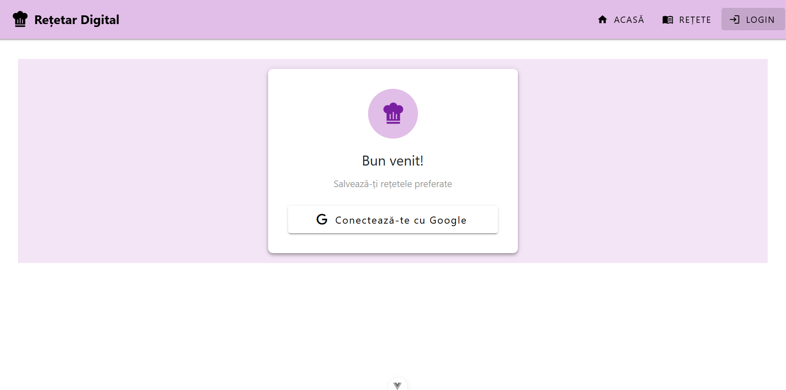
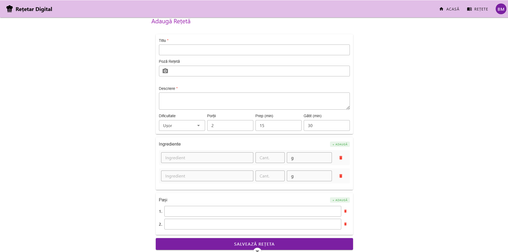
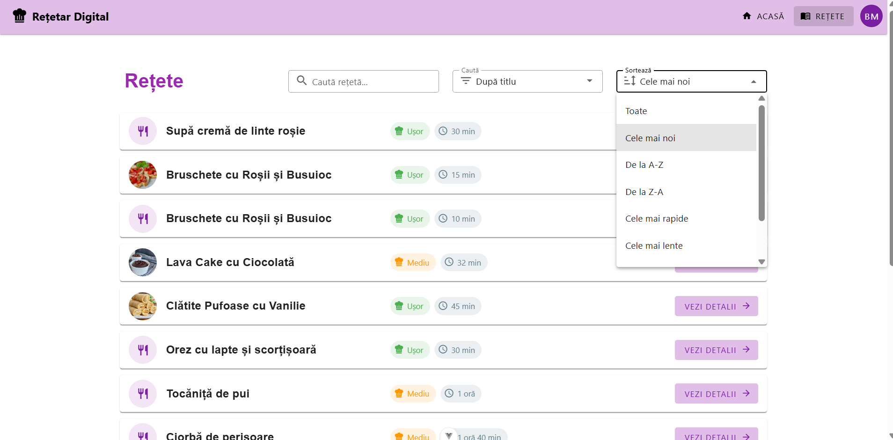

# Recipe Management System

O aplicație web modernă și completă pentru gestionarea rețetelor culinare. Proiectul demonstrează o arhitectură Full-Stack robustă, permițând utilizatorilor să își creeze un cont, să adauge rețete proprii, să le editeze și să exploreze o bază de date comună folosind funcționalități avansate de filtrare și optimizare.


---

## Funcționalități Principale

### Autentificare & Securitate
* **Înregistrare și Autentificare:** Sistem securizat bazat pe Firebase Auth.
* **Protecție Rute:** Gardieni (Route Guards) pentru a proteja paginile private (ex: `My Recipes`, `Add Recipe`).
* **Token Verification:** Middleware pe backend care verifică validitatea token-ului JWT la fiecare request de modificare sau ștergere.



### Managementul Rețetelor (CRUD)
* **Adăugare:** Formular complex cu validare pentru titlu, descriere, ingrediente, pași, timp și dificultate.
* **Editare:** Posibilitatea proprietarului de a modifica orice detaliu al unei rețete proprii.
* **Ștergere:** Ștergerea rețetelor (backend-ul validează dacă utilizatorul este autorul rețetei).
* **Vizualizare:** Listarea rețetelor sub formă de carduri interactive.



### UX & Performanță 
* **Instant Search (Client-Side Filtering):** Căutare în timp real fără latență. Deoarece lista de rețete este gestionată local în starea aplicației, filtrarea este instantanee.
* **Infinite Scroll:** Implementare eficientă pentru afișarea listelor, încărcând elemente progresiv pe măsură ce utilizatorul navighează.
* **Gzip Compression:** Backend-ul comprimă răspunsurile JSON pentru a reduce traficul de date și a accelera încărcarea.
* **Lazy Loading:** Rutele aplicației sunt încărcate dinamic, la cerere.



### Interfață (UI)
* **Responsive Design:** Layout adaptabil automat pentru Desktop, Tabletă și Telefon (folosind Vuetify Grid System).
* **Feedback Vizual:** Loadere animate, notificări toast și dialoguri de confirmare.

---

## Structura Proiectului

Proiectul este împărțit în două mari secțiuni: **Client** (Frontend) și **REST/API** (Backend).

### CLIENT
Organizarea modulară a resurselor în folderul `src`:

* **`components/`** — Unități UI reutilizabile:
    * `RecipeCard.vue` : Afișarea rezumată a rețetelor
    * `RecipeDetailsDialog.vue` : Vizualizarea extinsă a unei rețete
    * `RecipeForm.vue` : Logica de input pentru adăugare și editare
* **`composables/`** — Logica de business extrasă pentru reutilizare:
    * `useRecipeSorter.js` : Sortare cronologică sau alfabetică
    * `useRecipeValidator.js` : Validarea datelor introduse pe client
* **`stores/`** — Managementul stării globale cu Pinia:
    * `recipeStore.js` : Sincronizarea rețetelor cu API-ul
    * `user.js` : Gestionarea sesiunii și a profilului utilizatorului
    * `snackbar.js` : Sistemul global de notificări de tip toast
* **`views/`** — Paginile principale ale aplicației:
    * `HomeView.vue`, `RecipesView.vue`, `MyRecipesView.vue` : Vizualizări de liste și dashboard
    * `AddRecipeView.vue`, `EditRecipeView.vue` : Pagini dedicate gestionării conținutului
    * `LoginView.vue` : Pagina de acces în cont
* **`router/`** — Navigare și protecție:
    * `index.js` : Configurarea rutelor și a gardienilor de acces
* **`Configurări și Utilitare`** :
    * `firebaseConfig.js` & `firebase.js` : Conexiunea la serviciile Google
    * `axiosInstance.js` : Configurarea clientului HTTP pentru API
    * `utils/formatters.js` : Formatarea timpului și a dificultății rețetelor

### REST API
Arhitectură de tip MVC (Model-View-Controller) pentru backend:

* **`controllers/`** — Logica de procesare a cererilor:
    * `recipeController.js` : Logica CRUD pentru rețete
    * `uploadController.js` : Gestionarea încărcării imaginilor
* **`routes/`** — Definirea punctelor de acces:
    * `recipeRoutes.js`, `uploadRoutes.js` : Maparea endpoint-urilor către controllere
* **`middleware/`** — Filtre de securitate:
    * `checkAuth.js` : Verificarea token-ului JWT și a drepturilor de autor
* **`utils/`** — Servicii suport:
    * `errorHandler.js` : Centralizarea și gestionarea erorilor
    * `logger.js` : Monitorizarea cererilor în consolă
    * `validator.js`, `fileHelpers.js` : Validări de date și utilitare pentru fișiere
* **`Core`** — Configurația de bază a serverului:
    * `app.js` : Configurarea serverului și a middleware-urilor globale
    * `db.js` : Inițializarea conexiunii către baza de date Firestore
    * `seed.js` : Script pentru popularea automată cu date de test

---

## Tehnologii Utilizate

### Frontend
* **Framework:** Vue.js 3 (Composition API).
* **State Management:** Pinia.
* **Routing:** Vue Router (cu Lazy Loading).
* **UI Library:** Vuetify 3 (Material Design).

### Backend 
* **Runtime:** Node.js & Express.js.
* **Database & Storage:** Google Firestore (NoSQL) & Firebase Storage.
* **Securitate:** Firebase Admin SDK (Interacțiune securizată cu baza de date).
* **Middleware Performanță:** Compression (Gzip), Cors, Morgan.

---

## Instrucțiuni de Instalare și Rulare

### Pasul 1: Pornirea Backend-ului
API-ul se află în folderul `REST/API`.

1. Deschideți un terminal și navigați în folderul serverului:`cd REST/API`
2. Instalați dependențele:`npm install`
3. **Configurare obligatorie:**
   - Asigurați-vă că fișierul `serviceAccountKey.json` (cheia Firebase) este prezent în acest folder.
   - Creați un fișier `.env` în folderul `REST/API` cu următorul conținut:
     ```
     PORT=8080
     STORAGE_BUCKET=numele-proiectului-tau.appspot.com
     ```
4. Porniți serverul: `npm run dev`

### Pasul 2: Popularea Bazei de Date (Seeding)
Lăsați serverul pornit și deschideți un terminal nou (tot în folderul `REST/API`) pentru a rula scriptul: `node seed.js`


### Pasul 3: Pornire Frontend-ului
Aplicația Vue se află în folderul `CLIENT`.

1. Deschideți un terminal și navigați în folderul serverului:`cd CLIENT`
2. Instalați dependențele:`npm install`
3. **Configurare obligatorie:**
    - Creați un fișier `.env` în folderul clientului cu următorul conținut: ` VITE_API_URL=http://localhost:8080 `
4. Porniți serverul de dezvoltare:
   `npm run dev`
5. Accesați aplicația în browser la adresa: http://localhost:5173


---

## API Endpoints

| Metodă | Rută | Descriere | Auth (JWT) |
| :--- | :--- | :--- | :--- |
| **GET** | `/` | Pagina principală (Home) | Nu |
| **GET** | `/recipes` | Returnează lista tuturor rețetelor | Nu |
| **GET** | `/recipes/my-recipes` | Returnează rețetele userului logat | Da |
| **POST** | `/recipes` | Creează o rețetă nouă | Da |
| **PUT** | `/recipes/:id` | Actualizează o rețetă existentă | Da |
| **DELETE** | `/recipes/:id` | Șterge o rețetă | Da |

---

## Dezvoltări Viitoare
* **Dark Mode:** Tema întunecată.
* **Favorite:** Salvarea rețetelor preferate.
* **Social Sharing:** Distribuire pe rețelele sociale.
* **Sistem de Rating:** Recenzii și stele.

---

## Autor
**Matei Maria-Bianca** 
 * Facultatea: CIBERNETICĂ, STATISTICĂ ŞI INFORMATICĂ ECONOMICĂ 
 * Specializarea: E-Business 
 * Disciplina: Tehnologii ale informației și comunicațiilor